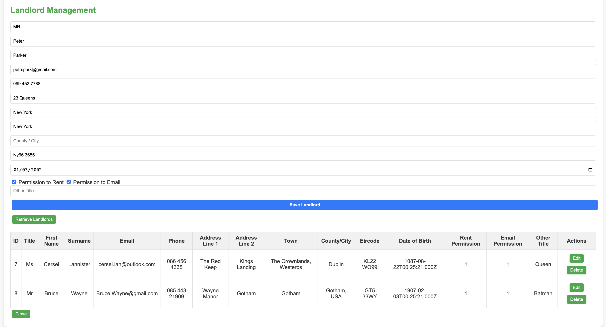
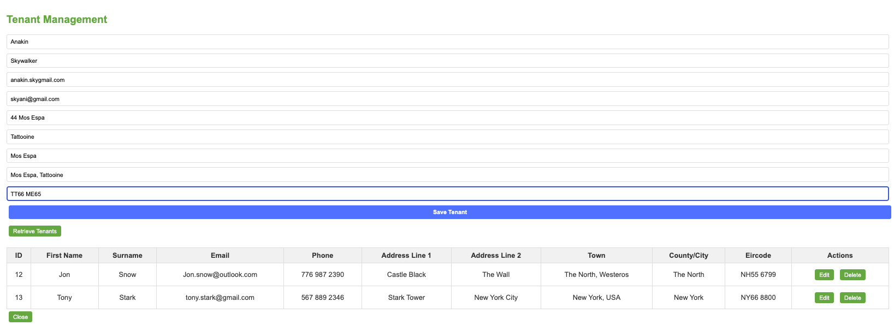
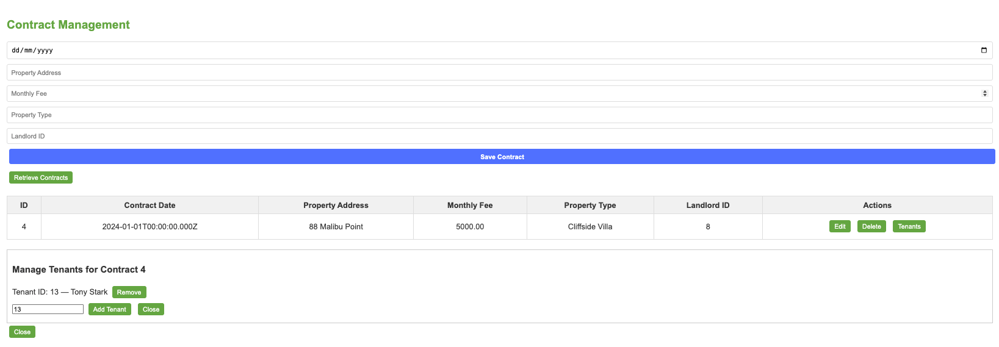

# Rental Management System

A full‑stack rental management application built with **Node.js**, **MySQL**, and a clean **vanilla JavaScript frontend**.  
It supports full CRUD operations for landlords, tenants, and contracts — plus a dedicated interface for linking tenants to contracts through a join table.

---

## 📸 Application Screenshots
Below are screenshots demonstrating the core CRUD functionality and the contract–tenant linking interface.

<h3>Landlords Management</h3>


<h3>Tenants Management</h3>


<h3>Contract–Tenant Linking</h3>


---


## Features

### Landlords
- Create, edit, delete landlords  
- View all landlords in a table  
- Clean and simple CRUD interface  

### Tenants
- Create, edit, delete tenants  
- View all tenants  
- Fully synced with backend MySQL  

### Contracts
- Create, edit, delete contracts  
- Assign a landlord to each contract  
- Manage contract details (date, address, fee, property type)

### Contract Tenant Linking
- Add tenants to a contract  
- Remove tenants from a contract  
- View all tenants assigned to a contract  
- Uses a join table: `contract_tenants`  
- Clean UI panel for managing tenants  

---

## Tech Stack

| Layer | Technology |
|-------|------------|
| Backend | Node.js, Express |
| Database | MySQL (mysql2) |
| Frontend | HTML, CSS, Vanilla JavaScript |
| Architecture | RESTful API |

---

## Project Structure

```
/server
  /controllers
    landlordController.js
    tenantController.js
    contractController.js
  /models
    landlordModel.js
    tenantModel.js
    contractModel.js
  /routes
    landlordRoute.js
    tenantRoute.js
    contractRoute.js
  /config
    db.js
  app.js

/client
  index.html
  script.js
  styles.css

/schema.sql
```

---

## Setup Instructions

### 1. Clone the repository
```bash
git clone <your-repo-url>
cd Renting-Database
```

### 2. Install backend dependencies
```bash
cd server
npm install
```

### 3. Configure MySQL
Create a database:
```sql
CREATE DATABASE renting_db;
```

Update `/server/config/db.js` with your MySQL credentials.

### 4. Import the database schema and sample data

This project includes a `schema.sql` file that:

- Creates the `renting_db` database (if it doesn’t exist)
- Creates all required tables:
  - `landlords`
  - `tenants`
  - `contracts`
  - `contract_tenants`
- Optionally inserts sample landlords, tenants, contracts, and links

To import everything:

```sql
SOURCE path/to/schema.sql;
```

### 5. Start the backend
```bash
node app.js
```

Backend runs at:
```
http://localhost:3000
```

### 6. Open the frontend
Open:
```
/client/index.html
```
in your browser.

---

## API Overview

### Landlords
```
GET    /api/landlords
GET    /api/landlords/:id
POST   /api/landlords
PUT    /api/landlords/:id
DELETE /api/landlords/:id
```

### Tenants
```
GET    /api/tenants
GET    /api/tenants/:id
POST   /api/tenants
PUT    /api/tenants/:id
DELETE /api/tenants/:id
```

### Contracts
```
GET    /api/contracts
GET    /api/contracts/:id
POST   /api/contracts
PUT    /api/contracts/:id
DELETE /api/contracts/:id
```

### Contract Tenant Linking
```
POST /api/contracts/addTenant
POST /api/contracts/removeTenant
```

---

## Optional Sample Data

The `schema.sql` file includes optional sample data so you don’t have to create everything manually.

It will insert:

- 10 landlords  
- 10 tenants  
- 3 example contracts  
- Contract–tenant links

This is useful for quickly testing the UI or demoing the project.  
If you prefer a clean database, remove or comment out the INSERT statements in `schema.sql` before running it.

---

## How to Use the App

### 1. Create landlords and tenants first
Contracts require a valid landlord ID.

### 2. Create a contract
Enter:
- Contract date  
- Property address  
- Monthly fee  
- Property type  
- Landlord ID  

### 3. Manage tenants for a contract
Click **Tenants** on any contract row.

You can:
- Add a tenant by ID  
- Remove tenants  
- View all assigned tenants  

---

## Future Improvements
- Dropdowns for selecting landlords/tenants  
- Search and filtering  
- Authentication  
- Property images  
- Dashboard analytics  

---

## Author
**Sean W.**  
Full‑stack developer building clean, maintainable systems.
